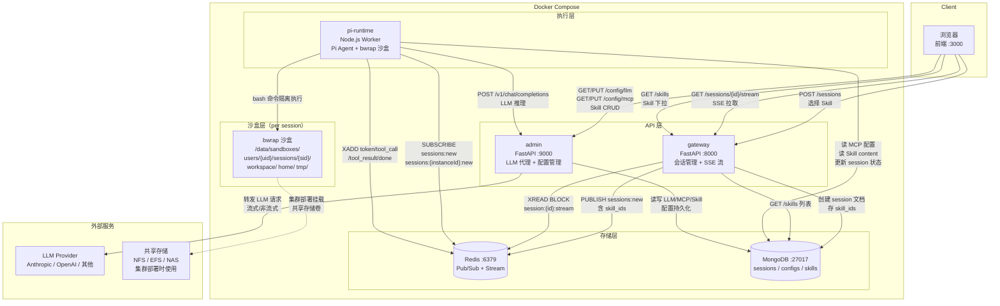

# Pi Agent Platform

基于 [Pi Coding Agent](https://pi.dev/) 构建的多租户 Agent 执行平台，支持会话管理、SSE 流式输出、bwrap 沙盒隔离、MCP 工具扩展、Skill 指令注入和动态配置管理。

---

## 整体架构



---

## 服务一览

| 服务 | 端口 | 技术栈 | 职责 |
|------|------|--------|------|
| **frontend** | 3000 | React + Vite + Tailwind | 对话界面 + 管理页面 |
| **gateway** | 8000 | Python FastAPI | 会话 CRUD、SSE 流式输出、Skill 列表 |
| **admin** | 9000 | Python FastAPI | LLM 代理、LLM/MCP/Skill 配置管理 |
| **pi-runtime** | — | Node.js + Pi Agent | Agent 执行、bwrap 沙盒、MCP 工具 |
| **redis** | 6379 | Redis 7 | 任务 Pub/Sub + 输出 Stream |
| **mongo** | 27017 | MongoDB 7 | sessions、configs、skills |

---

## 关键请求链路

### 1. 会话创建

```
用户 → POST /sessions { user_id, request, skill_ids }
  → gateway 创建 session 文档（MongoDB）
  → PUBLISH sessions:new { session_id, user_id, request, skill_ids }（Redis）
  → 返回 session_id
```

### 2. Pi Agent 执行

```
pi-runtime SUBSCRIBE sessions:new
  → 读 MongoDB：Skill content（按 skill_ids）+ MCP 配置
  → 创建 bwrap 沙盒（per session，/data/sandboxes/...）
  → 启动 pi --mode rpc
      ├── system prompt = 选定 Skill content（直接注入，跳过渐进式披露）
      ├── bwrap 扩展拦截 bash 工具 → 沙盒内执行（禁网络）
      └── read/write/edit 工具 → JS 层路径校验（限 workspace/home）
  → 每个输出事件 XADD session:{id}:stream（Redis Stream）
  → 任务完成：销毁沙盒、更新 session 状态
```

### 3. SSE 流式拉取

```
用户 → GET /sessions/{id}/stream
  → gateway 先读 MongoDB events_snapshot（断线重连回放）
  → XREAD BLOCK session:{id}:stream（持续拉取）
  → 逐事件推送 SSE：token / tool_call / tool_result / done / heartbeat
```

### 4. LLM 调用

```
pi-runtime → POST http://admin:9000/v1/chat/completions
  → admin 读内存缓存（零 DB IO）取 LLM 配置
  → 透传到真实 LLM Provider（支持 streaming）
```

---

## bwrap 沙盒隔离

每个 session 拥有完全独立的文件系统（**session 级隔离**）：

```
/data/sandboxes/users/{user_id}/sessions/{session_id}/
  workspace/   ← pi 工作目录（可读写，session 结束后销毁）
  home/        ← 独立 HOME（.bashrc、pip 包路径）
  tmp/         ← 临时文件
```

| 隔离维度 | 机制 |
|----------|------|
| 文件系统 | bwrap `--ro-bind / /` + `--bind {workspace}` |
| 网络 | bwrap `--unshare-net` |
| 进程空间 | bwrap `--unshare-pid` |
| 跨 session | 不同物理目录，互不可见 |
| 跨 user | 不同 user 目录，完全隔离 |

---

## Skill 系统

```
Admin 页创建 Skill → MongoDB skills 集合
  │
  ├── 对话页下拉列表（GET /skills → gateway → MongoDB）
  │
  └── 用户选定后随 session 创建请求传入
        → pi-runtime 从 MongoDB 读取 Skill content
        → 注入 pi RPC system prompt（明确注入，跳过 pi 自动 discover/activate）
```

---

## MCP 工具

pi 通过 `pi-mcp-adapter` 扩展调用 MCP Server：

| MCP Server | 工具 | 网络 | 说明 |
|-----------|------|------|------|
| filesystem | 文件读写 | 无 | 限制在 /workspace |
| http-client | http_get / http_post | 有 | 沙盒外执行 |
| database | db_find / db_count | 有 | MongoDB 只读查询 |

MCP 配置由 Admin 管理，pi-runtime 每个 session 启动时从 MongoDB 读取最新配置，新 session 即生效。

---

## 集群部署

```
单节点开发：
  bash deploy.sh

生产集群（3 个 pi-runtime 实例，NFS 共享存储）：
  NFS_SERVER_ADDR=192.168.1.100 NFS_EXPORT_PATH=/data/pi-sandboxes \
    bash deploy.sh --prod --scale 3
```

集群模式下，`sandbox_workspaces` 卷挂载 NFS/EFS/NAS，所有 pi-runtime 节点共享同一用户 workspace 数据。Sticky Session（Redis 路由）作为性能优化，减少跨节点 IO。

---

## 快速开始

```bash
# 1. 初始化配置
cp .env.example .env
# 编辑 .env，填写 LLM_API_KEY 和 LLM_BASE_URL

# 2. 一键部署
bash deploy.sh

# 3. 访问
# 前端   → http://localhost:3000
# API    → http://localhost:8000/docs
# Admin  → http://localhost:9000/docs
```

---

## 目录结构

```
pi-agent-platform/
├── deploy.sh              # 一键部署脚本
├── docker-compose.yml     # 单节点编排
├── docker-compose.prod.yml # 集群覆盖配置（NFS 卷）
├── .env.example
├── frontend/              # React + Vite 前端（README.md）
├── gateway/               # FastAPI 会话网关（README.md）
├── admin/                 # FastAPI 管理服务（README.md）
└── pi-runtime/            # Node.js Pi Agent 执行引擎（README.md）
```

各服务详细说明见对应目录的 `README.md`。
