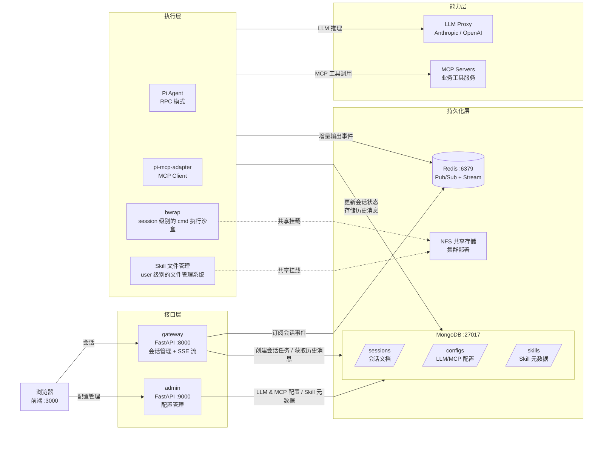

# Pi Agent Platform

基于 [Pi Coding Agent](https://pi.dev/) 构建的多租户 Agent 执行平台，支持会话管理、SSE 流式输出、bwrap 沙盒隔离、MCP 工具扩展、Skill 渐进式披露和动态配置管理。

---

## 整体架构（简要版）



---

## MongoDB 存储职责

| 集合 | 写入方 | 读取方 | 内容 |
|------|--------|--------|------|
| `sessions` | gateway（创建）/ pi-runtime（更新状态）| gateway（SSE 回放快照）| 会话文档、事件快照、状态 |
| `configs` | admin（LLM / MCP 配置）| admin（LLM 代理读内存缓存）/ pi-runtime（MCP 配置）| LLM Provider 配置、MCP Server 配置 |
| `skills` | admin（元数据）| gateway（下拉列表）| Skill 名称、描述、标签（不含正文）|

> Skill **正文内容**存储在文件系统（`/data/sandboxes/global/skills/{name}/SKILL.md`），不在 MongoDB 中。pi 原生渐进式披露直接读文件。

---

## MCP Server 管理关系

MCP Server 是**完全外部、与本项目解耦**的业务工具服务，由各业务方自行开发和部署。

```
业务方自行部署 MCP Server（任意语言、任意位置）
  ↓ 向 Admin 注册 endpoint
Admin 页配置 MCP Server（POST /config/mcp）
  → 写 MongoDB configs.mcp（存储 name / url / transport 等元数据）

  ↓ session 启动时
pi-runtime 读 MongoDB configs.mcp
  → 写 /tmp/pi-config/{session_id}/mcp.json
  → pi-mcp-adapter（MCP Client）加载配置
  → 用户 prompt 触发工具调用时，pi-mcp-adapter 通过 HTTP/SSE 连接 MCP Server
  → 工具调用完成，连接空闲超时自动断开
```

**本项目只实现 MCP Client 侧**（pi-mcp-adapter 插件），不包含任何 MCP Server 代码。新增工具能力只需部署新的 MCP Server 并在 Admin 注册，无需改动本项目。

---

## Skill 文件系统结构

```
/data/sandboxes/                    ← 共享持久化卷（admin + pi-runtime 共同挂载）
  global/skills/                    ← admin 管理的全局 skill（所有用户可用）
    python-expert/
      SKILL.md                      ← frontmatter(name/description) + 正文
    data-analysis/
      SKILL.md
      scripts/analyze.py            ← Skill tier 3：按需加载的脚本
  users/{user_id}/skills/           ← 用户专属 skill（user 级别隔离，持久化）
    custom-workflow/
      SKILL.md

session 启动时：
  PI_CODING_AGENT_DIR/skills/
    g_python-expert → symlink → global/skills/python-expert/
    u_custom-workflow → symlink → users/{uid}/skills/custom-workflow/
  
  用户选定 skill："--no-skills --skill {path}"（只加载选定的）
  用户未选定："pi 自动扫描 skills/ 目录"（全量渐进式披露）
```

---

## 关键请求链路

### 会话创建

```
用户 → POST /sessions { user_id, request, skill_ids }
  → gateway 创建 session（MongoDB）
  → PUBLISH sessions:new（Redis）
  → 返回 session_id
```

### Pi Agent 执行

```
pi-runtime SUBSCRIBE sessions:new
  → 读 MongoDB：MCP 配置
  → 创建 bwrap 沙盒（per session）
  → 软链 global + user skills 到 PI_CODING_AGENT_DIR/skills/
  → 启动 pi --mode rpc
      ├── 用户选了 skill：--no-skills --skill {path}（只披露选定范围）
      ├── 未选 skill：pi 自动扫描，渐进式披露全量 skill
      ├── bash 工具 → bwrap（禁网络）
      └── MCP 工具 → pi-mcp-adapter → 按需启动 MCP Server 进程
  → 每个输出事件 XADD stream（Redis）
  → 任务完成：销毁沙盒
```

### SSE 流式拉取

```
用户 → GET /sessions/{id}/stream
  → gateway 读 MongoDB events_snapshot（断线重连回放）
  → XREAD BLOCK stream（持续拉取）
  → 逐事件推送 SSE
```

---

## 服务一览

| 服务 | 端口 | 技术栈 | 职责 |
|------|------|--------|------|
| **frontend** | 3000 | React + Vite + Tailwind | 对话界面 + 管理页面（LLM/MCP/Skill 配置）|
| **gateway** | 8000 | Python FastAPI | 会话 CRUD、SSE 流、Skill 元数据列表 |
| **admin** | 9000 | Python FastAPI | LLM 代理、LLM/MCP/Skill 配置管理、写 SKILL.md 文件 |
| **pi-runtime** | — | Node.js + Pi Agent | Agent 执行、bwrap 沙盒、MCP Server 管理 |
| **redis** | 6379 | Redis 7 | 任务 Pub/Sub + 输出 Stream |
| **mongo** | 27017 | MongoDB 7 | sessions、configs（LLM/MCP）、skills 元数据 |

---

## 快速开始

```bash
# 1. 初始化配置
cp .env.example .env
# 编辑 .env，填写 LLM_API_KEY 和 LLM_BASE_URL

# 2. 一键部署
bash deploy.sh

# 3. 访问
# 前端   → http://localhost:3000
# API    → http://localhost:8000/docs
# Admin  → http://localhost:9000/docs
```

## 集群部署

```bash
# 生产集群：3 个 pi-runtime 实例，NFS 共享存储
NFS_SERVER_ADDR=192.168.1.100 NFS_EXPORT_PATH=/data/pi-sandboxes \
  bash deploy.sh --prod --scale 3
```

---

## 目录结构

```
pi-agent-platform/
├── README.md              # 本文件
├── deploy.sh              # 一键部署脚本
├── docker-compose.yml     # 单节点编排
├── docker-compose.prod.yml # 集群覆盖配置（NFS 卷）
├── .env.example
├── frontend/              # React + Vite 前端（README.md）
├── gateway/               # FastAPI 会话网关（README.md）
├── admin/                 # FastAPI 管理服务（README.md）
└── pi-runtime/            # Node.js Pi Agent 执行引擎（README.md）
```
