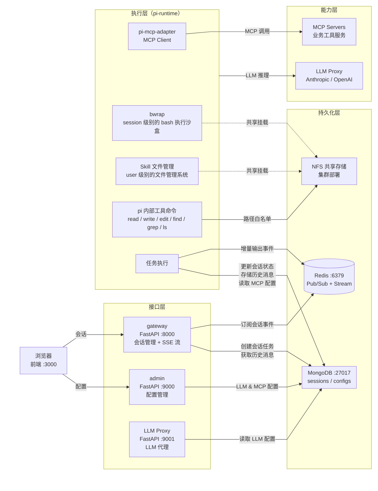

# Pi Agent Platform

基于 [Pi Coding Agent](https://pi.dev/) 构建的多租户 Agent 执行平台，支持会话管理、SSE 流式输出、bwrap 沙盒隔离、MCP 工具扩展、Skill 渐进式披露和动态配置管理。

---

## 整体架构



---

| 服务 | 端口 | 技术栈 | 职责 |
|------|------|--------|------|
| **frontend** | 3000 | React + Vite + Tailwind | 对话界面、LLM / MCP / Skill 配置管理页 |
| **gateway** | 8000 | Python FastAPI | 会话 CRUD、SSE 流式输出、Skill 元数据列表 |
| **admin** | 9000 | Python FastAPI | MCP Server 配置、Skill 管理（元数据 + 文件）|
| **llm-proxy** | 9001 | Python FastAPI | LLM 代理（OpenAI 兼容）、Provider 配置热更新 |
| **pi-runtime** | — | Node.js + Pi Agent | Agent 任务执行、bwrap 沙盒隔离、MCP 工具调用 |
| **redis** | 6379 | Redis 7 | 会话任务 Pub/Sub + 增量输出 Stream |
| **mongo** | 27017 | MongoDB 7 | 会话数据、LLM / MCP 配置、Skill 元数据 |

---

## 快速开始

```bash
# 一键部署（首次运行自动创建 .env）
bash deploy.sh

# 访问
# 前端      → http://localhost:3000
# API       → http://localhost:8000/docs
# Admin     → http://localhost:9000/docs
# LLM Proxy → http://localhost:9001/docs

# 启动后在前端管理页面配置 LLM Provider（base_url / api_key / model）
```

## 集群部署

```bash
# 生产集群：3 个 pi-runtime 实例，NFS 共享存储
NFS_SERVER_ADDR=192.168.1.100 NFS_EXPORT_PATH=/data/pi-sandboxes \
  bash deploy.sh --prod --scale 3
```

---

## 目录结构

```
pi-agent-platform/
├── README.md              # 本文件
├── deploy.sh              # 一键部署脚本
├── docker-compose.yml     # 单节点编排
├── docker-compose.prod.yml # 集群覆盖配置（NFS 卷）
├── .env.example
├── frontend/              # React + Vite 前端（README.md）
├── gateway/               # FastAPI 会话网关（README.md）
├── admin/                 # FastAPI 管理服务 - MCP/Skill 配置（README.md）
├── llm-proxy/             # FastAPI LLM 代理服务（README.md）
└── pi-runtime/            # Node.js Pi Agent 执行引擎（README.md）
```
